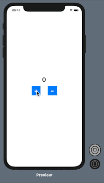

# Simple SwiftUI-ReSwift Counter

It is an simple counter example of SwiftUI and ReSwift.

## Preview


## Heriachy

```
ProjectRoot
|`- Redux                                                      
|    |`- Counter                    <---- Add Models like this
|    |    |`- CounterAction.swift   <--|                                      
|    |    |`- CounterReducer.swift  <--|                                       
|    |     `- CounterState.swift    <--'                       
|    |                                                      
|    |`- Redux.swift                <---- Add Redux setting
|    |`- AppState.swift             <--|              
|    |`- Middleware.swift           <--|                
|     `- ReduxStore.swift           <--'
|
|`- AppDelegate.swift
|`- SceneDelegate.swift             <---- Add Store Setting
 `- ContentView.swift                          
```

## Requirements

Xcode 11.6  
Swift 5.2.4  
ReSwift 5.0.0  

## Reference

- SwiftUI-Redux: https://github.com/kitasuke/SwiftUI-Redux
